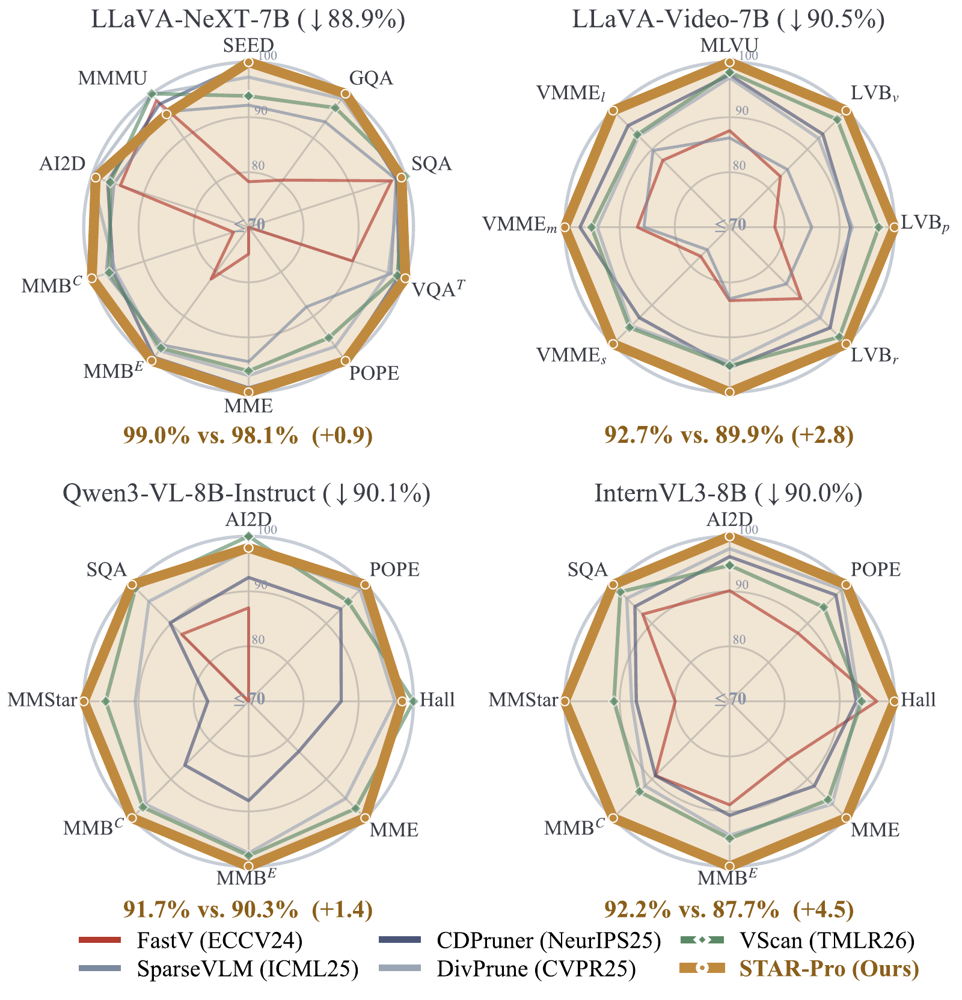
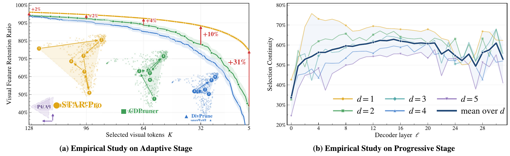
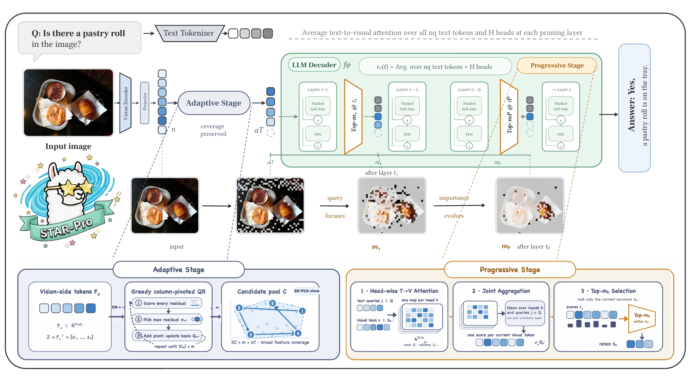
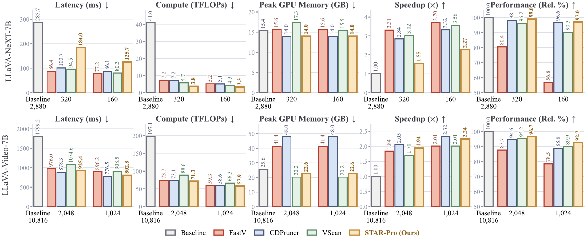
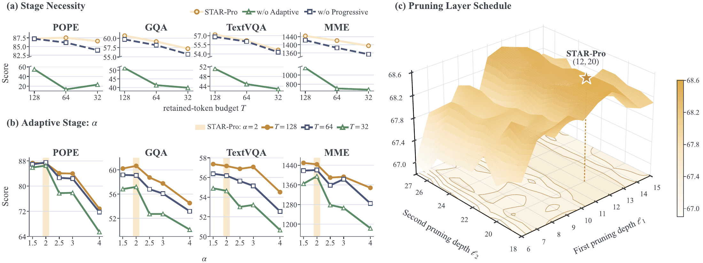
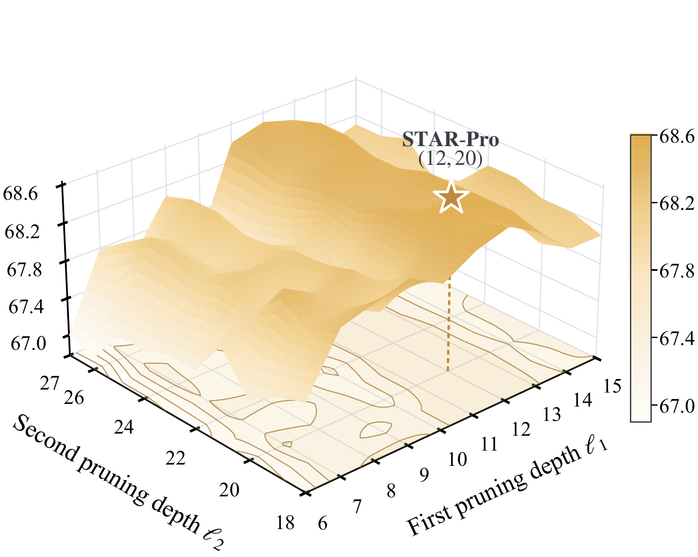
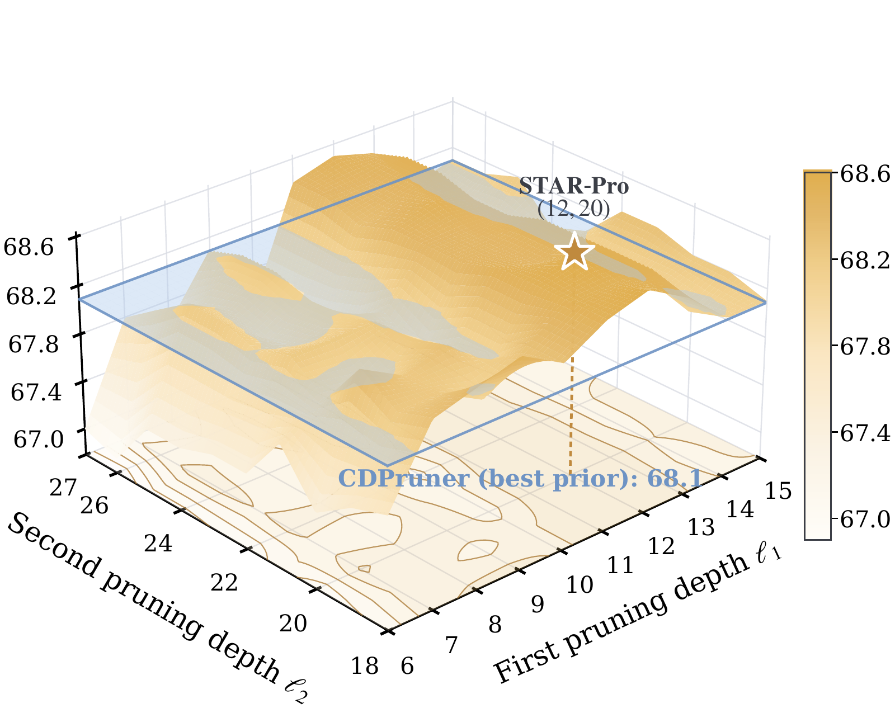
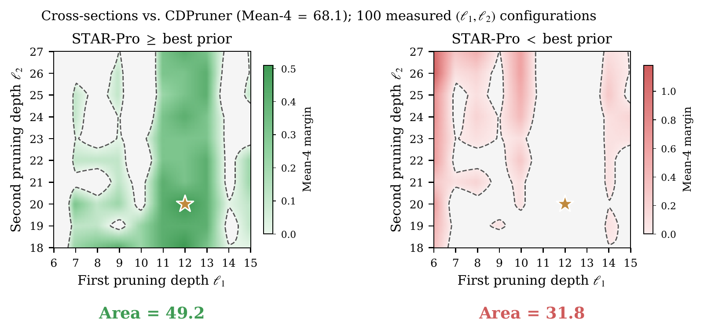
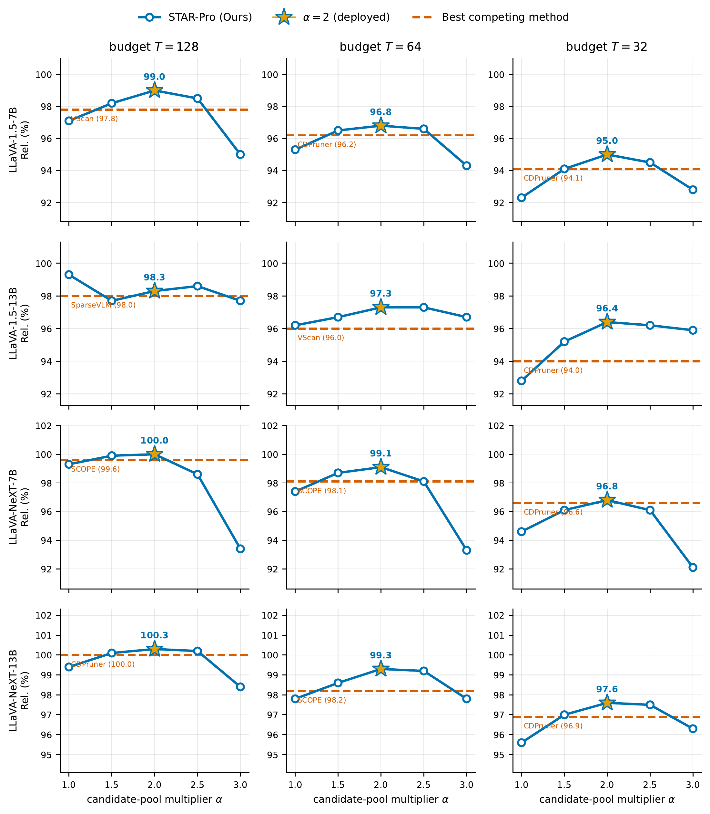

# STAR-Pro paper figures

[Repository home](../README.md) · [Paper tables](tables.md) · [Paper](https://arxiv.org/abs/2609.05916) · [PDF](https://arxiv.org/pdf/2609.05916v1)

Figures below are rendered from the figure sources used in **arXiv:2609.05916v1**
(5 September 2026). They preserve the published artwork and plotted values.
Click an image to open its full-resolution rendering. Figure numbers and page
links refer to this paper version.

## Figure 1 · Performance at approximately 90% token reduction

Each radar axis is normalized to the strongest plotted method. The percentages
below each panel compare STAR-Pro with the strongest competing method, relative
to the unpruned model. These are not raw benchmark accuracy values.
[Paper, page 1](https://arxiv.org/pdf/2609.05916v1#page=1).

## Figure 2 · Empirical study

Feature retention before fusion and continuity of attended visual tokens across
decoder layers. The attention study uses LLaVA-1.5-7B, K = 64, and 500 MME images.
[Paper, page 2](https://arxiv.org/pdf/2609.05916v1#page=2).

## Figure 3 · Method overview

The Adaptive Stage constructs a coverage-oriented candidate pool using pivoted
QR. At scheduled decoder layers, evolving text-to-visual attention progressively
refines a nested survivor set. The visual example follows the retained image
patches through these stages.
[Paper, page 4](https://arxiv.org/pdf/2609.05916v1#page=4).

## Figure 4 · Efficiency studies

Latency, operator-counted TFLOPs, peak allocated memory, speedup and relative
performance for LLaVA-NeXT-7B and 64-frame LLaVA-Video-7B.
[Paper, page 7](https://arxiv.org/pdf/2609.05916v1#page=7).

Timing uses one A800-80GB, batch size 1, one generated token, 10 warm-up samples
and 50 measured samples. CPU video decoding/preprocessing are excluded.
Operator-counted TFLOPs exclude unexposed fused attention and top-k/QR selection.
See [Appendix C.3, pages 17–18](https://arxiv.org/pdf/2609.05916v1#page=17).

## Figure 5 · Ablation studies

Stage contributions, candidate-pool multiplier sensitivity and matched-compute
pruning-layer configurations on LLaVA-1.5-7B.
[Paper, page 7](https://arxiv.org/pdf/2609.05916v1#page=7).

## Figure 6 · Pruning-schedule robustness

<table>
  <tr>
    <td></td>
    <td></td>
  </tr>
</table>

One hundred measured schedules on LLaVA-1.5-7B at T = 64. The star marks the
paper's deployed (12, 20) schedule; the reference is CDPruner's Mean-4 score of
68.1. These results describe the measured setting, rather than establishing a
universal optimum across architectures.
[Paper, page 20](https://arxiv.org/pdf/2609.05916v1#page=20).

## Figure 7 · Candidate-pool multiplier sensitivity

Relative performance across four LLaVA models and three layer-average budgets.
Stars mark the deployed α = 2 setting. The values come from the paper's multiplier
sweeps (Tables 13–16); they should not be substituted for the main-table results.
[Paper, page 21](https://arxiv.org/pdf/2609.05916v1#page=21).

## Asset index

The [figure manifest](../assets/figures/manifest.json) records each image's paper
figure/page, pixel dimensions and SHA-256. Figure 6 consists of three original
panels. The nine figure PNG files together reproduce all seven figures.

The [STAR-Pro logo](../assets/starpro-logo.png) is the original transparent mascot
embedded in the Figure 3 source artwork. It is reused as the repository logo,
with image pixels preserved and textual/EXIF metadata removed. Its dimensions
and SHA-256 are recorded separately in the same manifest.

Please cite [STAR-Pro](../README.md#citation) when discussing these figures.
