# STAR-Pro paper tables

[Repository home](../README.md) · [Paper figures](figures.md) · [Paper](https://arxiv.org/abs/2609.05916) · [PDF](https://arxiv.org/pdf/2609.05916v1)

All **16 tables** below are extracted directly from the published **arXiv:2609.05916v1** PDF (5 September 2026). Each image preserves the original table, formatting, values and complete caption. Click an image to open its full-resolution version.

[Main results](#main-results) · [Detailed results and configurations](#detailed-results-and-configurations) · [Ablations](#ablations)

The tables report the experiments in the paper. For runnable methods and models in this repository, see the [evaluation guide](evaluation.md).

## Main results

### Table 1 · LLaVA series

[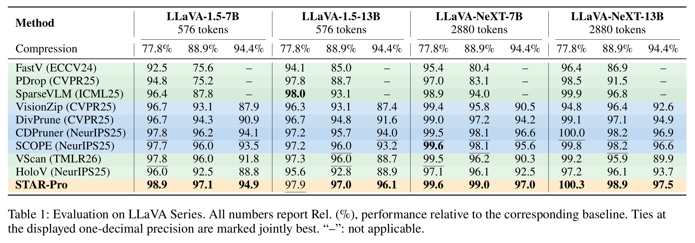](../assets/tables/table01-llava-series.png)

[Paper, page 5](https://arxiv.org/pdf/2609.05916v1#page=5).

### Table 2 · Video understanding

[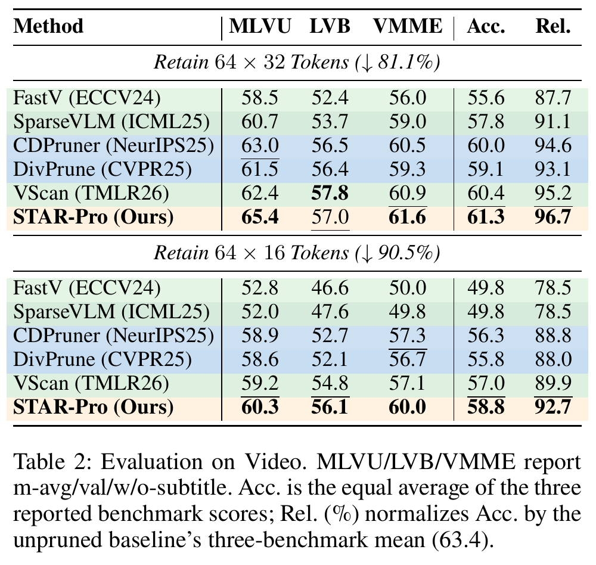](../assets/tables/table02-video.png)

[Paper, page 5](https://arxiv.org/pdf/2609.05916v1#page=5).

### Table 3 · Advanced architectures

[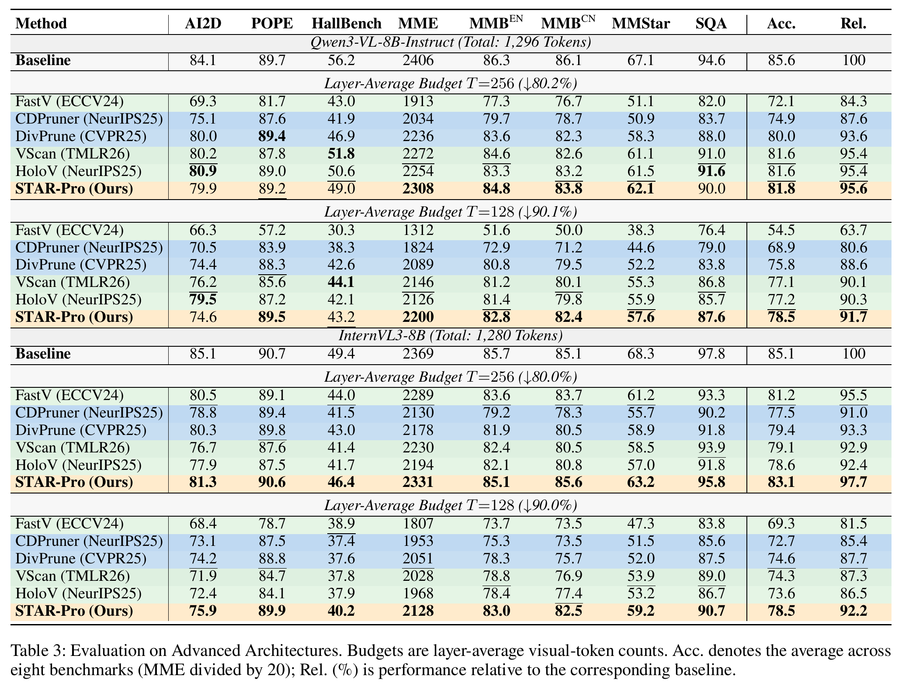](../assets/tables/table03-advanced-architectures.png)

[Paper, page 6](https://arxiv.org/pdf/2609.05916v1#page=6).

### Table 4 · Adaptive-Stage overhead

[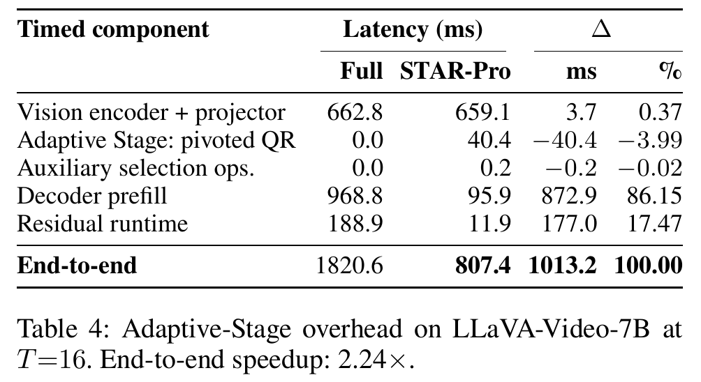](../assets/tables/table04-adaptive-stage-overhead.png)

[Paper, page 6](https://arxiv.org/pdf/2609.05916v1#page=6).

## Detailed results and configurations

### Table 5 · Architecture-specific pruning checkpoints

[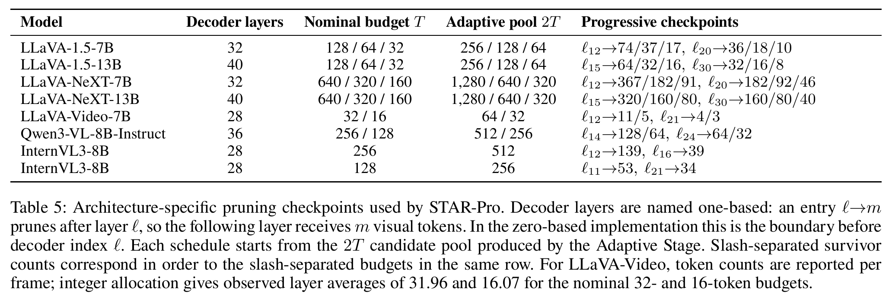](../assets/tables/table05-pruning-checkpoints.png)

[Paper, page 14](https://arxiv.org/pdf/2609.05916v1#page=14).

### Table 6 · LLaVA-1.5-7B results

[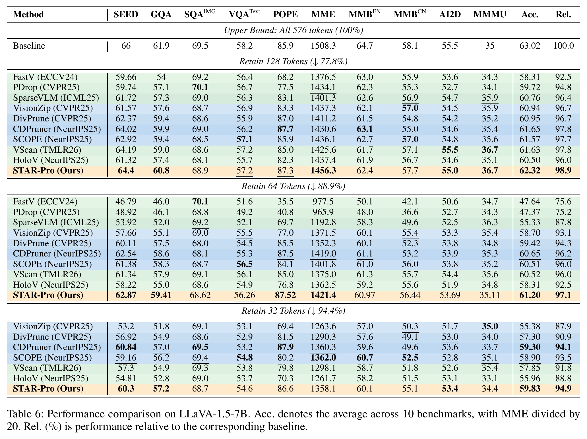](../assets/tables/table06-llava15-7b.png)

[Paper, page 15](https://arxiv.org/pdf/2609.05916v1#page=15).

### Table 7 · LLaVA-1.5-13B results

[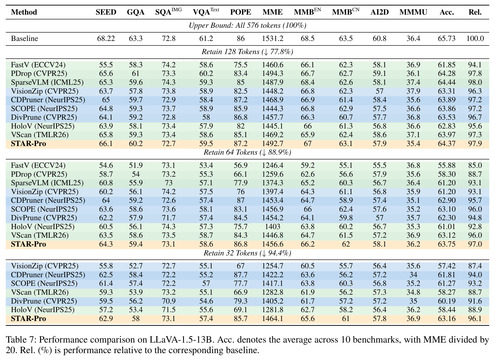](../assets/tables/table07-llava15-13b.png)

[Paper, page 16](https://arxiv.org/pdf/2609.05916v1#page=16).

### Table 8 · LLaVA-NeXT-7B results

[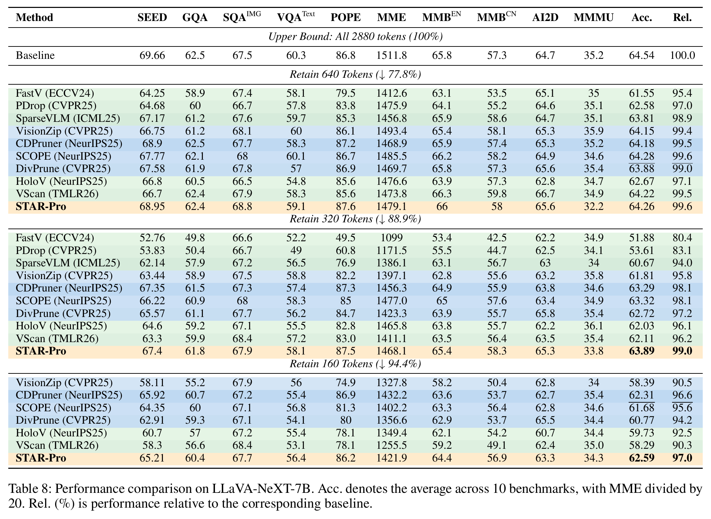](../assets/tables/table08-llava-next-7b.png)

[Paper, page 17](https://arxiv.org/pdf/2609.05916v1#page=17).

### Table 9 · LLaVA-NeXT-13B results

[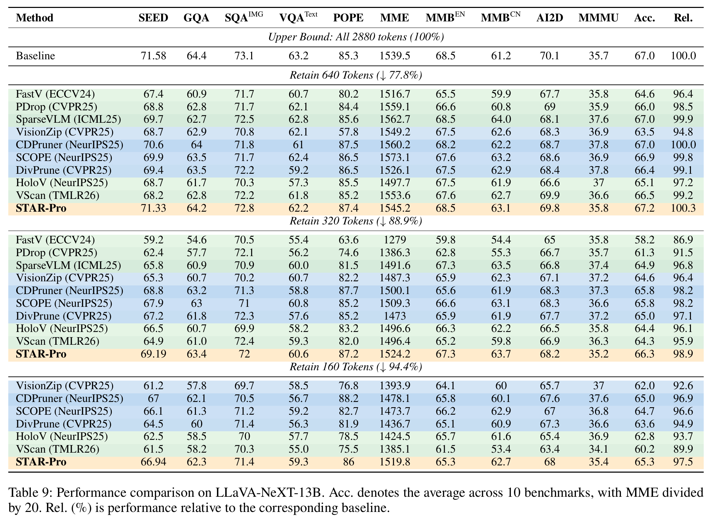](../assets/tables/table09-llava-next-13b.png)

[Paper, page 18](https://arxiv.org/pdf/2609.05916v1#page=18).

### Table 10 · Full LLaVA-Video-7B results

[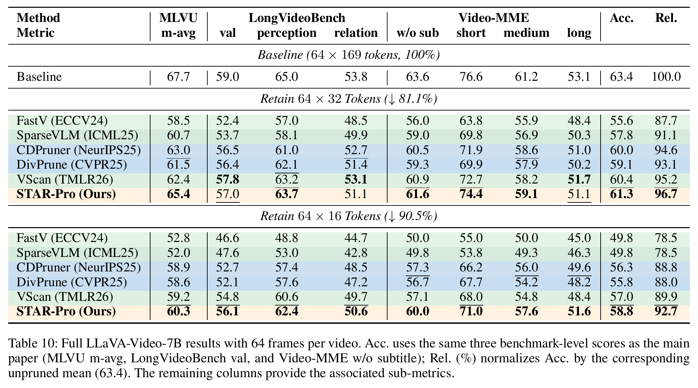](../assets/tables/table10-video-full.png)

[Paper, page 19](https://arxiv.org/pdf/2609.05916v1#page=19).

## Ablations

### Table 11 · Matched-compute controls

[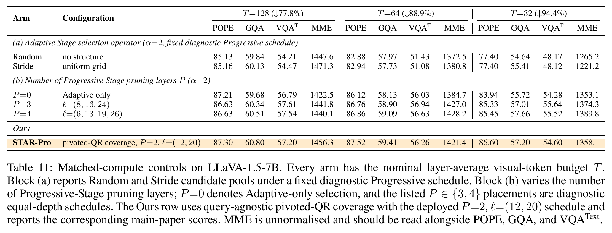](../assets/tables/table11-matched-compute.png)

[Paper, page 23](https://arxiv.org/pdf/2609.05916v1#page=23).

### Table 12 · Per-layer token allocation

[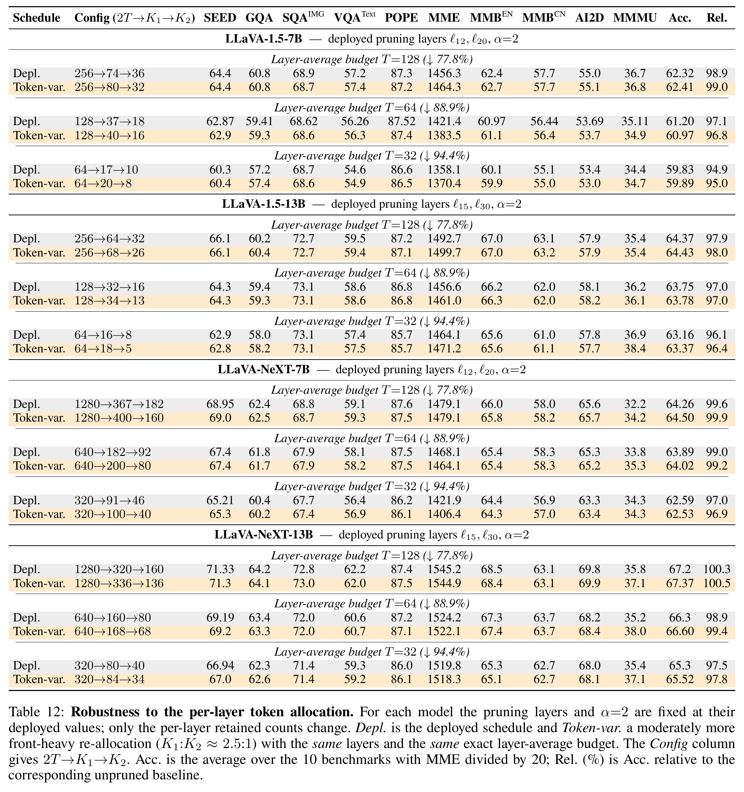](../assets/tables/table12-token-allocation.png)

[Paper, page 24](https://arxiv.org/pdf/2609.05916v1#page=24).

### Table 13 · Candidate-multiplier sweep: LLaVA-1.5-7B

[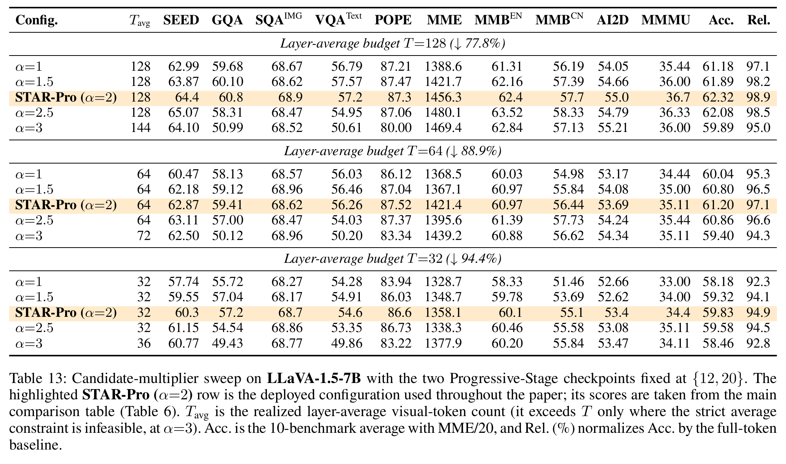](../assets/tables/table13-candidate-sweep-llava15-7b.png)

[Paper, page 25](https://arxiv.org/pdf/2609.05916v1#page=25).

### Table 14 · Candidate-multiplier sweep: LLaVA-1.5-13B

[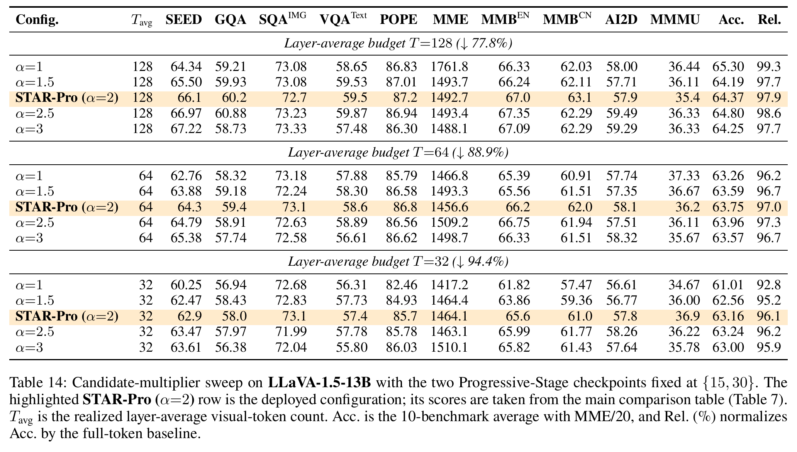](../assets/tables/table14-candidate-sweep-llava15-13b.png)

[Paper, page 25](https://arxiv.org/pdf/2609.05916v1#page=25).

### Table 15 · Candidate-multiplier sweep: LLaVA-NeXT-7B

[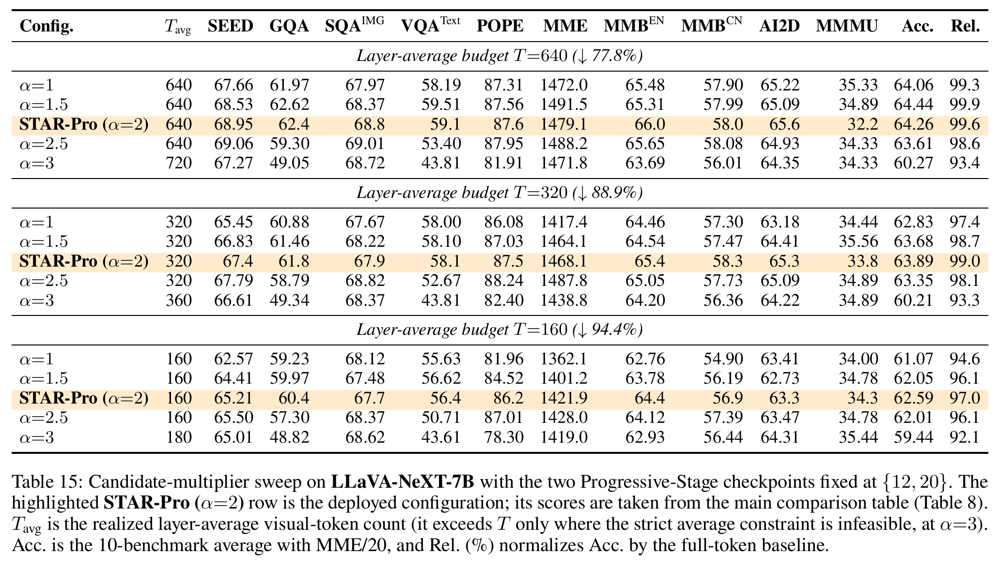](../assets/tables/table15-candidate-sweep-llava-next-7b.png)

[Paper, page 26](https://arxiv.org/pdf/2609.05916v1#page=26).

### Table 16 · Candidate-multiplier sweep: LLaVA-NeXT-13B

[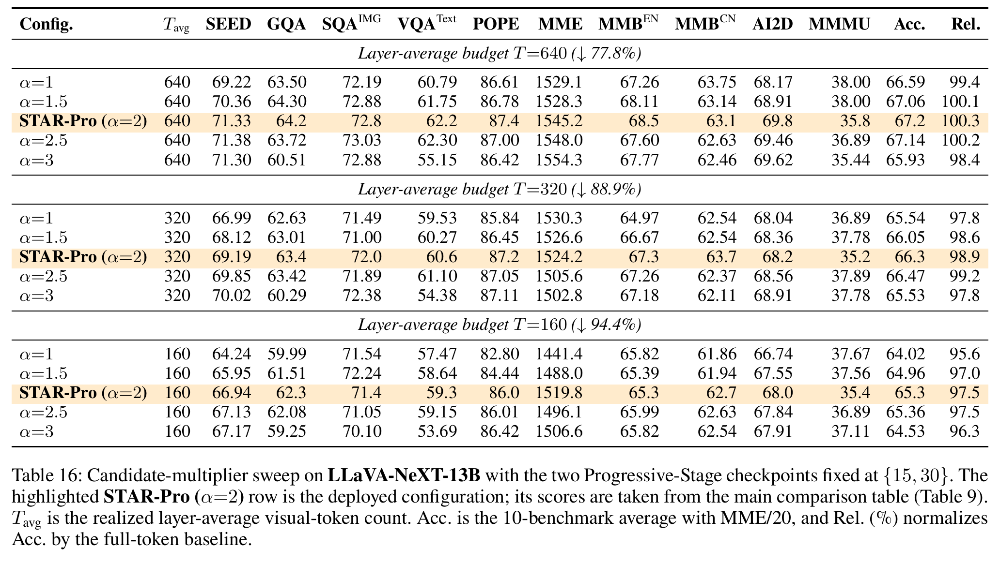](../assets/tables/table16-candidate-sweep-llava-next-13b.png)

[Paper, page 26](https://arxiv.org/pdf/2609.05916v1#page=26).

## Asset index

The [table manifest](../assets/tables/manifest.json) records the paper version, page, clipping rectangle, pixel dimensions and SHA-256 of every image. All images use the same 288 dpi rendering; no result table was reconstructed from text.

Please cite [STAR-Pro](../README.md#citation) when discussing these results.
